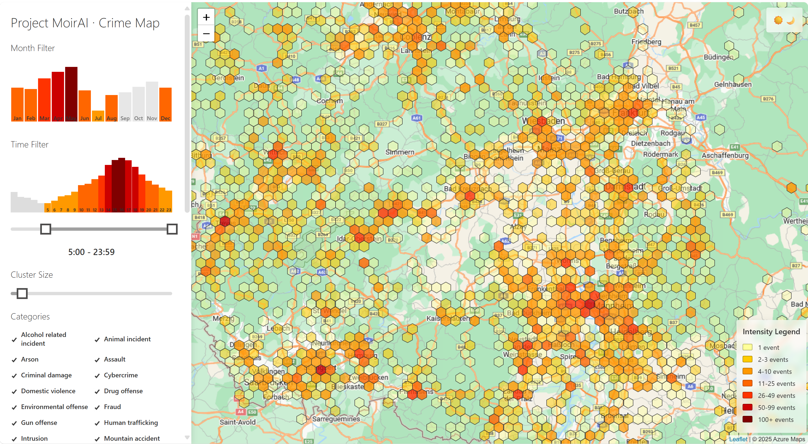

# Project MoirAI - Crime Prediction

The goal of Project MoirAI is to find and design reliable models suitable for processing a large number of different feature categories, most prominently spatio-temporal-linguistic data.



## Quickstart

1. Clone this repository `git clone https://github.com/project-moirai/crime-prediction.git`.
2. Switch to the cloned directory and open `index.html` in a browser. Ensure you can navigate through the map and set filters.
3. Take a look at the data in `data/data-gpt4o-v2.jsonl`. It contains over 37,000 police incidents collected over the course of a year.
4. Switch directory to `/experiments` and open file `train.py` in an editor, take a look at what is happening in the training script.
5. Make sure you have Python installed, create a new virtual environment `python -m venv .venv` and activate it (Linux: `source .venv/bin/activate`).
6. Install dependencies with `pip install -r v-xgboost/requirements.txt`.
7. Run `python v-xgboost/train.py` to train the model.
8. Run e.g. `python v-xgboost/predict.py 12-01 12:00 46 5.5` to get a prediction, if and which crime might happen at a certain time and location.

## Data format

| Property   | Description                                 | Sample value                         |
|------------|---------------------------------------------|--------------------------------------|
| guid       | Unique Id of the crime event                | aad6ff60-1991-4eea-92cc-75401fc1794c |
| country    | ISO 3166-1 country code                     | de                                   |
| date       | Date of the event in MM-DD format           | 12-31                                |
| time       | Time of the day when the event happened     | 14:30                                |
| category   | Type(s) of incident (see list below)        | ["theft", "drug-offense"]            |
| summary    | Short description of the incident           | Theft of cash and drugs              |
| lat        | Latitude coordinate of the event            | 49.3791                              |
| lng        | Longitude coordinate of the event           | 8.0783                               |

Categories can be at maximum two of the following (24 in total):

```
["alcohol-related-incident", "animal-incident", "arson", "assault", "criminal-damage", "cybercrime", "domestic-violence", "drug-offense", "environmental-offense", "fraud", "gun-offense", "human-trafficking", "intrusion", "murder", "mountain-accident", "other", "public-disturbance", "robbery", "search-and-rescue", "sexual-assault", "suicide", "traffic-accident", "theft", "vandalism"]
```

Data for each country was collected from the following sources:

| Country    | Source                            |
|------------|-----------------------------------|
| at         | www.polizei.gv.at/{county}/presse |
| de         | www.presseportal.de               |

## Methodologies & models

The most promising models and methodologies used will be described here in more detail after the hackathon.

## Contributors

We'd like to thank the following contributors, without whom this project would not have been possible:
- Christian Vorhemus
- Matteo Corvaro
- Jelena Simic